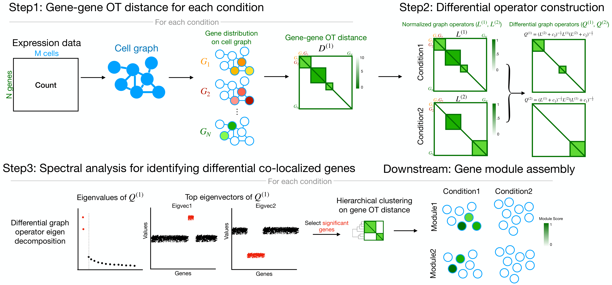

# Differential Co-Localization Analysis

<!-- badges: start -->
<!-- badges: end -->

Differential Co-Localization analysis (DiCoLo) is a computational
framework designed for capturing condition-specific co-localized gene
patterns within single-cell RNA sequencing data. The major workflow of
DiCoLo comprises the following three main steps:

- Step1. Compute gene-gene OT distance for each condition
- Step2. Construct differential graph operator
- Step3. Identify differential co-localized genes by spectral analysis
- Downstream tasks
  - Assemble significant DiCoLo genes into co-localized gene modules.



## Installation

DiCoLo can be installed in R as follows:

``` r
install.packages("devtools")
devtools::install_github("KlugerLab/DiCoLo")

library("DiCoLo")
```

## Example tutorial

Please check [DiCoLo
tutorial](https://klugerLab.github.io/DiCoLo/articles/).

## References

References of DiCoLo functions can be found
[here](https://klugerLab.github.io/DiCoLo/reference/index.html).

For additional information, please reference our pre-print:

**DiCoLo: Integration-free and cluster-free detection of localized
differential gene co-expression in single-cell data** Ruiqi Li, Junchen
Yang, Pei-Chun Su, Ariel Jaffe, Ofir Lindenbaum, Yuval Kluger *bioRxiv*
2025 November 26. doi: <https://doi.org/10.1101/2025.11.23.689932>
