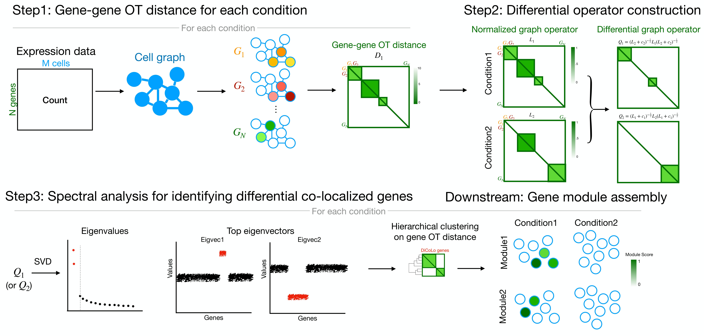

```{r, include = FALSE}
knitr::opts_chunk$set(
  collapse = TRUE,
  comment = "#>"
)
```

# Overview
Differential Co-Localization analysis (DiCoLo) is a computational framework designed for capturing condition-specific co-localized gene patterns within single-cell RNA sequencing data. The major workflow of DiCoLo comprises the following three main steps:

* Step1. Compute gene-gene OT distance for each condition
* Step2. Construct differential graph operator
* Step3. Identify differential co-localized genes by spectral analysis
* Downstream tasks
  * Assemble significant DiCoLo genes into co-localized gene modules.

```{r pressure, echo=FALSE, out.width="100%", out.height="auto"}

```

# Loading required R packages
```{r, warning = FALSE, message=FALSE}
##### Load required R libraries
library("Seurat")
library("ggplot2")
library("patchwork")
source("./DiCoLo_functions.R")
```

# Loading example data
We use a 10x mouse embryonic skin dataset which includes a SmoM2 mutant sample with a paired wildtype control (CTL) sample. The preprocessed Seurat object for this tutorial can be downloaded from [figshare for Mutant](https://figshare.com/ndownloader/files/55008218) and [figshare for Wildtype](https://figshare.com/ndownloader/files/55008224).

```{r, warning = FALSE, message=FALSE}
dir.path.data = "~/" # Specify the directory path where you want to save the data
file_name1 = "data_S_smom2_dermal_E13.5_MUT.rds" # Specify the file name for saving the mutant
file_name2 = "data_S_smom2_dermal_E13.5_CTL.rds" # Specify the file name for saving the wildtype
```
```{r dimplot, warning = FALSE, message=FALSE, results='hide', fig.retina=1, out.width="100%",fig.width=12, fig.height=5}
data_S_MUT <- readRDS(file = file.path(dir.path.data,file_name1))
data_S_CTL <- readRDS(file = file.path(dir.path.data,file_name2))


p1 = DimPlot(data_S_MUT, 
          group.by = "celltype", shuffle = TRUE, cols = c("DC"="#d1495b", "UD" = "#edae49", "LD" = "#d3d3d3")) + ggtitle("Mutant") & NoAxes()
p2 = DimPlot(data_S_CTL, 
          group.by = "celltype", shuffle = TRUE, cols = c("DC"="#d1495b", "UD" = "#edae49", "LD" = "#d3d3d3")) + ggtitle("Wildtype") & NoAxes()
p1 + p2 + plot_layout(guides = "collect")
```

# Step1: Compute Gene-gene OT distance for each condition

In this tutorial, we adapt the framework of [GeneTrajectory](https://klugerlab.github.io/GeneTrajectory/articles/GeneTrajectory.html)[@qu2024gene] to compute the gene-gene OT distance per condition. We start by select the genes expressed in 0.5–50% of cells and ranked among the top 500 highly variable genes (HVGs) within each sample. Genes detected in fewer than one cell in either sample are excluded and we use the union of the filtered gene sets for downstream computation.

```{r, warning = FALSE, message = FALSE}
common_genes = SelectCommonGenes(data_S_MUT,data_S_CTL,
                                   ngenes = 500)
```

The computation of gene-gene OT distances is employing GeneTrajectory framework (see the [Compute gene-gene distances](https://klugerlab.github.io/GeneTrajectory/articles/GeneTrajectory.html#compute-gene-gene-distances) section). We (a) install GeneTrajectory in R, (b) ensure Python is available (either `python` or `python3` on your system PATH), and (c) install the Python POT library. To keep the R session responsive, the computation runs in the background with multiple processes (default: 8). The expected running time for this step is approximately 5~10 minutes.

Install (one time)
```{r, warning = FALSE, message = FALSE, eval=FALSE}
# --- R side: install GeneTrajectory ---
if (!requireNamespace("GeneTrajectory", quietly = TRUE)) {
  if (!requireNamespace("devtools", quietly = TRUE)) install.packages("devtools")
  devtools::install_github("KlugerLab/GeneTrajectory")
}

# --- Python side: install POT ---
# Find a usable python executable (python3 preferred)
py <- Sys.which("python3")
if (py == "") py <- Sys.which("python")
if (py == "") stop("No Python found. Please install Python and ensure it is on your PATH.")

# Install/upgrade POT in that Python
cmd <- sprintf('"%s" -m pip install -U https://github.com/PythonOT/POT/archive/master.zip', py)
message("Installing/Updating POT with: ", cmd)
system(cmd)
```

Run the OT distance computation
```{r, warning = FALSE, message = FALSE}
dir.path.MUT = "~/GeneTrajectory_MUT" # Specify the folder name for saving the MUT OT distance
dir.path.CTL = "~/GeneTrajectory_CTL" # Specify the folder name for saving the CTL OT distance
```
```{r, warning = FALSE, message = FALSE, eval=FALSE}
ComputeGeneEMD(data_S_MUT, common_genes, dir.path = dir.path.MUT)
ComputeGeneEMD(data_S_CTL, common_genes, dir.path = dir.path.CTL)
```

Load OT distance
```{r, warning = FALSE, message = FALSE}
gene.dist.mat_MUT = LoadGeneEMD(file.path(dir.path.MUT,""))
gene.dist.mat_CTL = LoadGeneEMD(file.path(dir.path.CTL,""))
```

# Step2: Construct differential graph operators
We next build normalized graph operators and differential graph operators based on the OT distance matrices.
Each condition-specific graph operator is first computed from its gene–gene OT distance matrix, and the differential operators are then constructed by comparing the mutant and control graphs.
```{r, warning = FALSE, message = FALSE}
gene.graph_MUT = ComputeGraphOperator(gene.dist.mat_MUT)
gene.graph_CTL = ComputeGraphOperator(gene.dist.mat_CTL)

diff.op_MUT = ComputeDifferentialOperator(gene.graph_MUT,gene.graph_CTL)
diff.op_CTL = ComputeDifferentialOperator(gene.graph_CTL,gene.graph_MUT)
```

# Step3: Spectral analysis to identify differential co-localization patterns
We perform a spectral decomposition of the differential operator (e.g., `diff.op_MUT`). Significant components are selected by the knee point of the eigenvalue spectrum.

The example below uses the MUT differential operator; the same procedure applies to CTL.
```{r, warning = FALSE, message = FALSE}
eigen_list <- RunSVD(diff.op_MUT, eig_keep = nrow(diff.op_MUT))
```

Select significant components via knee point.
```{r knee_point, warning = FALSE, message=FALSE, results='hide', fig.retina=1, out.width="50%",fig.align='center',fig.width=5, fig.height=5}
n_eigvec = FindKneePoint(eigen_list$values[1:floor(sqrt(length(eigen_list$values)))],plot.fig = TRUE) - 1
```

Visualize the significant eigenvectors on gene embeddings for MUT and CTL, where each gene embedding is obtained by applying t-SNE to the OT distance matrix computed from [Step1](#step1-compute-gene-gene-ot-distance-for-each-condition)

```{r, warning = FALSE, message = FALSE}
tsne_MUT = ObtainGeneTSNE(as.dist(gene.dist.mat_MUT))
tsne_CTL = ObtainGeneTSNE(as.dist(gene.dist.mat_CTL))
```
```{r eigen_vec, warning = FALSE, message=FALSE, results='hide', fig.retina=1, out.width="100%",fig.width=20, fig.height=6}
pl = lapply(1:n_eigvec,function(i){
  gene_partition = setNames(eigen_list$vectors[,i],rownames(eigen_list$vectors))
  p1 = VisualizeGeneTSNE(gene_embedding = tsne_MUT,
                         gene_partition = gene_partition, filtered = FALSE) + 
    ggtitle(paste0("Eigenvector",i)) + labs(color = "loadings")
  p2 = VisualizeGeneTSNE(gene_embedding = tsne_CTL,
                         gene_partition = gene_partition, filtered = FALSE) + ggtitle("") + labs(color = "loadings")
  p1 / p2
})
wrap_plots(pl, nrow = 1)
```

Each selected eigenvector highlights genes with large absolute loadings that cluster closely together in the MUT condition (top row) but appear more dispersed in the CTL condition (bottom row), indicating that these genes are co-localized in MUT but not in CTL.

# Downstream: Gene module assembly

After identifying significant eigenvectors from the differential graph operator, DiCoLo assembles co-localized gene modules by selecting high-loading genes and clustering them based on their gene–gene OT distances.

## Select significant genes from eigenvectors

For each selected eigenvector, we extract genes with large absolute loadings. Loadings are first standardized (z-scores), and significance is determined using a local false discovery rate (localFDR) model `locfdr::locfdr`. Genes are selected with their estimated FDR below the threshold returned by the model.
```{r signif genes, warning = FALSE, message=FALSE, results='hide', fig.retina=1, out.width="100%",fig.width=20, fig.height=3}
gene_loadings = eigen_list$vectors[,1:n_eigvec]
gene_indictors = SelectSignificantGenes(gene_loadings)
pl = lapply(1:ncol(gene_indictors),function(i){
  VisualizeGeneTSNE(gene_embedding = tsne_MUT,
                    gene_partition = as.factor(gene_indictors[,i]), 
                    filtered = FALSE, text = FALSE,
                    module_color = c("1"="red","0"="lightgrey")) + 
    labs(color = "Signif. genes") + ggtitle(paste0("Eigenvector",i))
})
wrap_plots(pl, nrow = 1) + plot_layout(guides = "collect")
```
Significant genes are highlighted in red for each selected eigenvector and overlaid on the MUT gene embedding.

## Cluster significant genes into modules
Significant genes are then grouped into modules based on their OT distances computed in [Step1](#step1-compute-gene-gene-ot-distance-for-each-condition). We perform hierarchical clustering (`stats::hclust`, method = `average`) on the OT distance matrix and cut the dendrogram using `dynamicTreeCut::cutreeDynamic` to obtain coherent, co-localized gene modules.
To ensure module quality, genes with mean intra-module distances greater than $median+3\times MAD$ are excluded as outliers. Only modules containing at least 5 genes are retained for downstream analysis.

```{r, warning = FALSE, message = FALSE}
signf_genes = rownames(gene_indictors)[rowSums(gene_indictors) > 0]
gene_modules = ClusterGenes(as.dist(gene.dist.mat_MUT[signf_genes,signf_genes]),min_gene = 5, deepSplit = 0)
```

The importance of the each gene module can be ranked based on how strongly its member genes are represented across the selected eigenvectors, with higher ranks given to those dominated by high-significance eigenvectors.
```{r, warning = FALSE, message = FALSE}
gene_modules = RankGeneModules(gene_modules,gene_indictors,eigen_list$values)
```
```{r gene modules, warning = FALSE, message=FALSE, results='hide', fig.retina=1, out.width="50%",fig.align='center',fig.width=6, fig.height=4}
VisualizeGeneTSNE(gene_embedding = tsne_MUT,
                    gene_partition = gene_modules, 
                    filtered = FALSE, text = FALSE) + ggtitle("MUT DiCoLo gene modules")
```

## Visualize module activity across cells
Module activity scores are computed using `Seurat::AddModuleScore`, standardized to zero mean and unit variance, and re-scaled to $[0,1]$. These scores highlight where each module is active on the cell manifold under each condition.
```{r, warning = FALSE, message = FALSE}
gene_modules_ls = split(names(gene_modules), gene_modules)
data_S_ls = list(data_S_MUT, data_S_CTL)
data_S_ls = lapply(data_S_ls, function(data_S){
  DefaultAssay(data_S) = "RNA"
  data_S <- AddModuleScore(
    object = data_S,
    features = gene_modules_ls,
    ctrl = 100,
    name = "Module"
  )
  module_score = data_S@meta.data[,grepl("Module",colnames(data_S@meta.data))]
  module_score = apply(module_score,2,function(x) scale(x)[,1])
  module_score = apply(module_score,2,function(x) (x - min(x)) / (max(x) - min(x)))
  data_S = AddMetaData(data_S,module_score)
})
```

```{r module score, warning = FALSE, message=FALSE, results='hide', fig.retina=1, out.width="100%",fig.width=12, fig.height=8}
pl = lapply(data_S_ls,function(data_S){
  suppressMessages(FeaturePlot(data_S, features = paste0("Module",seq_len(length(gene_modules_ls))), ncol = length(gene_modules_ls)) & 
  scale_colour_gradientn(colours = brewer.pal(n = 9, name = "Reds")) & NoAxes())
})

(wrap_plots(pl,nrow = 2) & NoAxes() & ggtitle(NULL)) + plot_layout(guides = "collect")
```

# Session information
```{r, warning = FALSE}
sessionInfo()
```

# References

